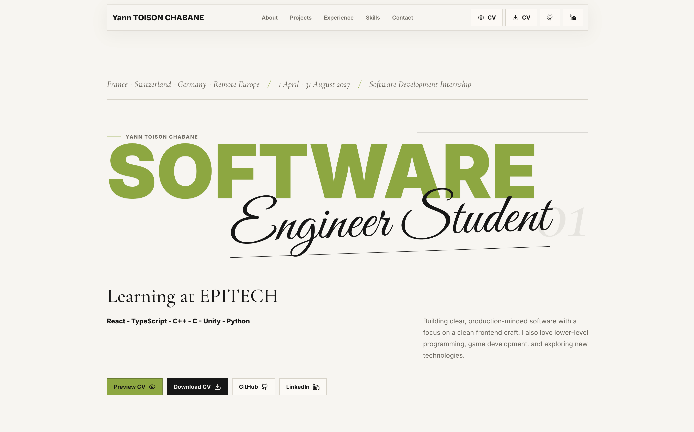

<div align="center">

# MyPortfolio

**Personal portfolio — React frontend backed by a typed Express API reading a private SQLite database.**

<br/>

[](https://yanntc.dev/)
[](https://api.yanntc.dev)
[](https://github.com/yann-tc)

<br/>


</div>

---



---

## Overview

This repository contains two packages:

- **`frontend/`** — React 19 app built with Vite. Fetches typed portfolio resources from the API and renders the public-facing site.
- **`backend/`** — Express API with Zod-validated routes. Reads `backend/data/portfolio.sqlite` via `sql.js` (chosen to avoid native SQLite/glibc issues on the VM). The database file is gitignored.

---

## Tech stack

### Frontend
| | |
|---|---|
| [React 19](https://react.dev/) | UI library |
| [TypeScript 5](https://www.typescriptlang.org/) | Static typing |
| [Vite 6](https://vitejs.dev/) | Build tool & dev server |
| [Lucide React](https://lucide.dev/) | Icons |

### Backend
| | |
|---|---|
| [Express](https://expressjs.com/) | HTTP server |
| [TypeScript](https://www.typescriptlang.org/) | Static typing |
| [Zod](https://zod.dev/) | Runtime schema validation |
| [sql.js](https://sql.js.org/) | WebAssembly SQLite, no native bindings |

### Infrastructure
| | |
|---|---|
| Nginx | Reverse proxy |
| Certbot | HTTPS via Let's Encrypt |
| systemd | API process management |

---

## Project structure

```
.
├── frontend/
│   ├── src/
│   │   ├── app/            ← app shell + minimal path router
│   │   ├── pages/          ← HomePage, LegalNoticePage
│   │   ├── components/
│   │   ├── lib/
│   │   └── main.tsx
│   ├── index.html
│   ├── vite.config.ts
│   └── tsconfig.json
│
├── backend/
│   ├── src/
│   │   ├── routes/
│   │   ├── app.ts
│   │   └── server.ts
│   ├── data/
│   │   └── portfolio.sqlite   ← production only, gitignored
│   └── tsconfig.json
│
└── README.md
```

---

## Getting started

### Prerequisites

- Node.js ≥ 18

### Frontend

```bash
cd frontend
npm install
npm run dev      # Vite dev server
npm run build    # outputs to frontend/dist/
```

### Backend

```bash
cd backend
npm install
npm run dev      # ts-node / nodemon
npm run build    # compiles to dist/
npm start        # runs compiled output
```

> Place your database at `backend/data/portfolio.sqlite` before starting the API.

---

## Deployment

1. **systemd** — starts the Express API on boot, restarts on failure.
2. **Nginx** — proxies `api.yanntc.dev` to the local Express port; serves the static frontend build for `yanntc.dev`.
3. **Certbot** — manages TLS for both domains.
4. **Cloudflare** — sits in front as DNS + CDN proxy.

```bash
# deploy frontend
cd frontend && npm run build
# copy dist/ to Nginx web root

# deploy backend
cd backend && npm run build
sudo systemctl restart portfolio-api
```

The frontend is a single-page app: the client resolves `/legal-notice`
itself, so the Nginx `location` serving `yanntc.dev` must fall back to
`index.html` for unknown paths.

```nginx
location / {
    try_files $uri $uri/ /index.html;
}
```

---

<div align="center">

· [yanntc.dev](https://yanntc.dev/) ·

</div>
